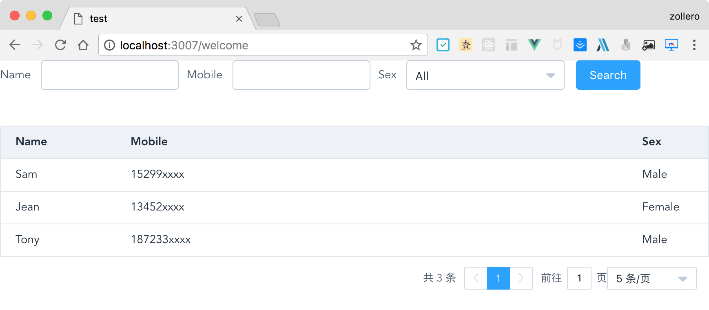

# Element search table pagination

> Combines Form, Table and Pagination components of [Element UI](https://github.com/ElemeFE/element) together. Based on Vue 2.x.

> You can use this package to show local and remote list data in table with search form and pagination.



[See the code of the **Screen shot**](#quick-start)

## Install

```
$ npm i --save el-search-table-pagination
```

## Demos

See demos of [**Local Data**](https://codepen.io/zollero/pen/wPRqYX) and [**Remote Data**](https://codepen.io/zollero/pen/xPmXBp) on **CodePen**.

## API

[API](./docs/en_US.md)  |  [中文API](./docs/zh_CN.md)

## Quick Start

Import modules and set up settings in `main.js`:

```js
import Vue from 'vue'
import ElSearchTablePagination from 'el-search-table-pagination'

// Default use axios as HTTP tool
Vue.use(ElSearchTablePagination)
// or set a custom HTTP tool
import axios from 'axios'
Vue.use(ElSearchTablePagination, {
    axios
})
```

> Use this package to show **remote** data in a page:

```vue
<template>
  <el-search-table-pagination
    url="example.xxx.com/list"
    :columns="columns"
    :formOptions="formOptions">
  </el-search-table-pagination>
</template>

<script>
  export default {
    data() {
      return {
        formOptions: {
          inline: true,
          submitBtnText: 'Search',
          forms: [
            { prop: 'name', label: 'Name' },
            { prop: 'mobile', label: 'Mobile' },
            { prop: 'sex', label: 'Sex', itemType: 'select',
              options: [
                { value: '', label: 'All' },
                { value: 0, label: 'Male' },
                { value: 1, label: 'Female' }
              ]
            }
          ]
        },
        columns: [
          { prop: 'name', label: 'Name', width: 140 },
          { prop: 'mobile', label: 'Mobile', minWidth: 180 },
          { prop: 'sex', label: 'Sex', width: 80,
            render: row => {
              const { sex } = row
              return sex === 0 ? 'Male' : sex === 1 ? 'Female' : 'Unknow'
            }
          }
        ]
      }
    }
  }
</script>
```


And the Test page is the image above.

> Use this package to show **local** data in a page:

```vue
<template>
  <el-search-table-pagination
    type="local"
    :data="tableData"
    :page-sizes="[5, 10]"
    :columns="columns"
    :form-options="formOptions">
  </el-search-table-pagination>
</template>

<script>
  export default {
    data() {
      return {
        formOptions: {
          inline: true,
          submitBtnText: 'Search',
          forms: [
            { prop: 'name', label: 'Name' },
            { prop: 'mobile', label: 'Mobile' },
            { prop: 'sex', label: 'Sex', itemType: 'select',
              options: [
                { value: '', label: 'All' },
                { value: 0, label: 'Male' },
                { value: 1, label: 'Female' }
              ]
            }
          ]
        },
        columns: [
          { prop: 'name', label: 'Name', width: 140 },
          { prop: 'mobile', label: 'Mobile', minWidth: 180 },
          { prop: 'sex', label: 'Sex', width: 100,
            render: row => {
              const { sex } = row
              return sex === 0 ? 'Male' : sex === 1 ? 'Female' : 'Unknow'
            }
          }
        ],
        tableData: [
          { name: 'Sam', mobile: '15299xxxx', sex: 0 },
          { name: 'Jean', mobile: '13452xxxx', sex: 1 },
          { name: 'Tony', mobile: '187233xxxx', sex: 0 }
        ]
      }
    }
  }
</script>
```

## LICENSE

MIT
